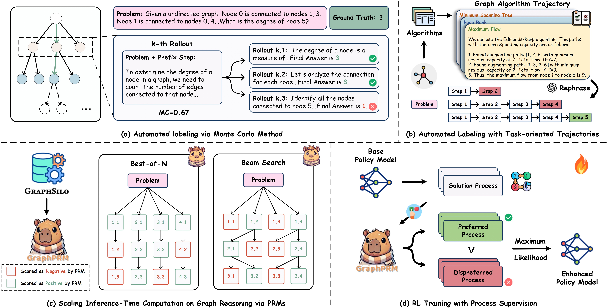

# GraphPRM: Rewarding Graph Reasoning Process makes LLMs more Generalized Reasoners

<div align="left">
   <p>
   <a href='https://arxiv.org/abs/2503.00845'></a>
   <a href='https://huggingface.co/datasets/GraphPRM/GraphSilo'></a>
   <a href='https://huggingface.co/GraphPRM/GraphPRM-7B'></a>
   <a href='https://github.com/GKNL/GraphPRM'></a>
   <a href="https://doi.org/10.5281/zenodo.15553492"></a>
   </p>
</div>


**GraphPRM** is the first Process Reward Model tailored for graph reasoning tasks, which further enhancing LLMs' mathematical reasoning capabilities on other reasoning domains, including mathematical problem-solving tasks. We also developed **GraphSilo**, the largest dataset for graph reasoning with fine-grained CoT solutions, with 118,189 samples and 394,165 step-wise labels.

This repository contains the code and data for training and evaluating GraphPRM models, along with the full GraphSilo dataset. Please check our [paper](https://arxiv.org/abs/2503.00845) for more details.

<p align="center">
  
</p>

## 💫 News

- **[2025.05.15]** GraphPRM is accepted to **KDD 2025 Research Track**. 🔥🔥🔥
- **[2025.02.15]** Initial release of 🤗[GraphSilo](https://huggingface.co/datasets/GraphPRM/GraphSilo) dataset and 🤗[GraphPRM](https://huggingface.co/GraphPRM/GraphPRM-7B) models. 🚀🚀🚀

## 📊 Dataset and Models

The full GraphSilo dataset and GraphPRM models can be accessed at:

- **GraphSilo Dataset**: [GraphSilo](https://huggingface.co/datasets/GraphPRM/GraphSilo), [GraphSilo-Test](https://huggingface.co/datasets/GraphPRM/GraphSilo-Test)
- **GraphPRM Models**: [GraphPRM-1.5B](https://huggingface.co/GraphPRM/GraphPRM-1.5B), [GraphPRM-7B](https://huggingface.co/GraphPRM/GraphPRM-7B)

## 📦 Installation

```bash
conda create -n GraphPRM python=3.10
conda activate GraphPRM
pip install -r requirements.txt
pip3 install "fschat[model_worker,webui]"
pip install -U pydantic
cd envs/MATH/latex2sympy
pip install -e .
cd -
```

## 🛠️ Usage

### Download Models

Before running the project, please ensure that all required base models are downloaded to directory `hugging_cache`.

### Start LM & RM Services

1. Modify the following variables in `reason/llm_service/create_service.sh`:
   - `$MODEL_BASE`: Directory where models are stored
   - `$POLICY_MODEL_NAME`: Name of the policy model
   - `$VALUE_MODEL_NAME`: Name of the graph reward model
   - `$NUM_LM_WORKER`: Number of language model workers
   - `$NUM_RM_WORKER`: Number of reward model workers

2. Start the services:
```bash
sh reason/llm_service/create_service.sh
```

3. To stop the services:
```bash
tmux kill-session -t {Your Session Name} # default is `GraphPRM`
```

### Training GraphPRM

```bash
cd prm/code

CUDA_VISIBLE_DEVICES=0,1,2,3 torchrun --nproc_per_node=4 finetune_qwen_SFT.py \
    --model_path $YOUR_MODEL_PATH \
    --data_path $YOUR_DATA_FOLDER_PATH
```

### Inference Methods

#### Best-of-N Strategy
```bash
export PYTHONPATH=$(pwd)
sh scripts/eval/cot_rerank.sh

# Key parameters:
# --LM Qwen2.5-7B-Instruct                        # Policy Model name
# --RM GraphPRM-7B                                # Reward Model name
# --temperature 0.7                               # Generation temperature
# --num_sequence 8                                # Number of generated samples
# --max_new_tokens 2048                           # Max new tokens
# --test_set_path dataset/GraphSilo_test.jsonl    # Test data path
```

#### Beam Search Strategy
```bash
export PYTHONPATH=$(pwd)
sh scripts/eval/beam_search.sh

# Key parameters:
# --LM Qwen2.5-7B-Instruct                        # Policy Model name
# --RM GraphPRM-7B                                # Reward Model name
# --temperature 0.7                               # Generation temperature
# --num_sequence 2                                # Samples per step
# --tree_max_width 4                              # Generated samples per step
# --tree_max_depth 50                             # Max steps
# --max_new_tokens 2048                           # Max new tokens
# --test_set_path dataset/GraphSilo_test.jsonl    # Test data path
```

## 📁 Project Structure

```
GraphPRM/
├── data/
│   ├── GraphSilo/
│   │   ├── train.jsonl
│   │   └── step_wise_labels.jsonl
│   └── GraphSilo_test/
│       ├── in_domain/
│       │   ├── degree.jsonl
│       │   ├── clustering_coefficient.jsonl
│       │   ├── jaccard.jsonl
│       │   └── ...
│       └── out_domain/
│           ├── bfs.jsonl
│           ├── neighbor.jsonl
│           └── cycle.jsonl
├── prm/
│   ├── code/
│   │   └── finetune_qwen_SFT.py
│   └── config/
│       └── deepspeed_config_stage3.json
├── reason/
│   └── llm_service/
│       └── create_service_graph.sh
└── scripts/
    └── eval/
        ├── best_of_N.sh
        └── beam_search.sh
```

### Key Components

- **data/**: Contains the GraphSilo dataset
  - `GraphSilo/`: Training set with step-wise reasoning trajectories
  - `GraphSilo_test/`: Test set for 13 graph tasks
    - In-domain tasks (10): Degree, Clustering Coefficient, Jaccard, etc.
    - Out-domain tasks (3): BFS, Neighbor, Cycle

- **prm/**: Process Reward Modeling related code
  - `code/`: SFT training code
  - `config/`: DeepSpeed configuration files for training

- **reason/**: Reasoning service implementation
  - `llm_service/`: Service startup and management scripts

- **scripts/**: Evaluation and utility scripts
  - `eval/`: Inference scripts for different strategies

## Acknowledge
Some code implementations are built upon [OpenR](https://github.com/openreasoner/openr) Repository. We sincerely appreciate the efforts for their contributions.

## 📜 Citation

If you find GraphPRM useful for your research and applications, please kindly cite using this BibTeX:

```
@misc{graphprm,
      title={Rewarding Graph Reasoning Process makes LLMs more Generalized Reasoners}, 
      author={Miao Peng and Nuo Chen and Zongrui Suo and Jia Li},
      year={2025},
      eprint={2503.00845},
      archivePrefix={arXiv},
      primaryClass={cs.CL},
      url={https://arxiv.org/abs/2503.00845}, 
}
```